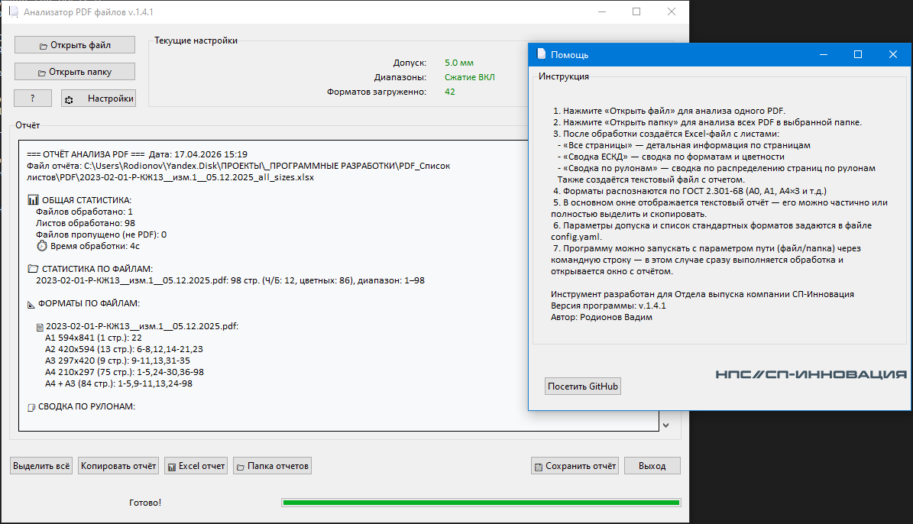
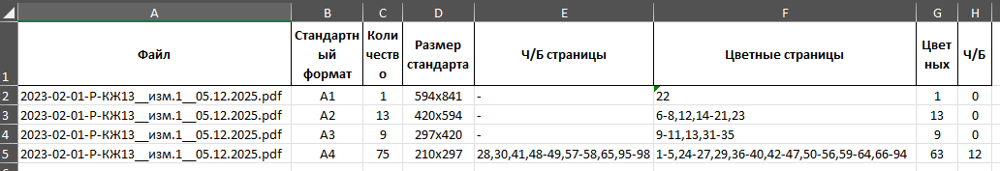

# PDF Page Analyzer 📄 #


Автоматический анализ PDF документов для подбора принтера и планирования печати. 

Позволяет работать как с одним файлом, так и целой папкой.

Позволяет определить:

✅ Какие форматы в каком файле

✅ Точные размеры каждого формата

✅ Количество страниц по файлу+формату

✅ Полный список страниц

Идеально для планирования печати по файлам! 📁📐✅

## ✨ Возможности ##
| ✅ Что анализирует	| ✅ Что выдаёт |
|-----|-----|
| Размеры всех страниц (мм)	| Стандартные форматы ГОСТ 2.301-68 |
| Поворот страниц (0/90/180/270°)	| A0, A1, A4×3, A3×7 и др. (24 формата) |
| Цветность (Ч/Б vs Цветная)	| Excel с 2 листами: "Все страницы" + "Сводка" |
| Обработка одного PDF или папки	| GUI-отчёт с логотипом и копированием |


📊 Пример отчёта
```text
📐 ФОРМАТЫ ПО ФАЙЛАМ:

  plan1.pdf:
    A4 210x297 (45 стр.): 1,2,3,4,5,6,7,8,9,10,...
    A3×4 420x1189 (12 стр.): 46,47,48,49,50,51,...

  plan2.pdf:
    A4 210x297 (32 стр.): 1,2,3,4,5,6,7,8,9,10,...
```

## 🚀 Быстрый старт ##

### 1. Установка ###
``` bash
pip install pymupdf pandas openpyxl pyyaml
```
или
``` bash
pip install -r requirements.txt
```

### 2. Конфигурация (config.yaml) ###
```text
tolerance_mm: 5.0  # Допуск распознавания ±5мм
compress_ranges: 1  # Сжимать диапазоны 1-да, 0-нет.
formats:
  A4: [210, 297]
  A3: [297, 420]
  A0: [841, 1189]
  # ... 24 формата ЕСКД
```
### 3. Запуск ###
```bash
# GUI режим
python pdfpages_pro.py

# CLI-режим: один файл
python pdfpages_pro.py "C:\docs\project.pdf"

# CLI-режим: Папка с PDF
python pdfpages_pro.py "C:\PDFs"
```
### 4. Результат ###

✅ project_all_sizes.xlsx (рядом с файлом)

✅ project_all_sizes_report.txt (рядом с файлом)

✅ GUI-отчёт (статистика + копирование)

#### 📁 Структура проекта ###

```text
📁 pdfpages_pro/
├── pdfpages_pro.py     # Основной скрипт ⭐
├── config.yaml         # Конфиг / Настройки форматов
├── logo.png           # Логотип (опционально)
├── icon.png           # Иконка приложения
├── README.md          # Этот файл
└── requirements.txt   # Зависимости
```

## 🎯 Выходные данные (Excel) ##
Лист "Все страницы":
| Файл | Страница | Поворот | Ширина | Высота | Формат | Размер стандарта | Цветность | 
|-----|-----|-----|-----|-----|-----|-----|-----|
|plan1.pdf	|1	|0	|210.0|	297.0|	A4	|210x297	|Ч/Б|

Лист "Сводка ЕСКД":
|Файл	|Формат	|Кол-во	|Ч/Б стр.	|Цветные стр.|	Цветных|	Ч/Б|
|-----|-----|-----|-----|-----|-----|-----|
|plan1.pdf|	A4|	45|	1,2,3...|	46,47...	|12|	33|

## 🛠 Компиляция в EXE ##
```bash
pyinstaller --onefile ^
    --windowed ^
    --add-data "logo.png;." ^
    --add-data "icon.png;." ^
    --icon "logo.ico" ^
    --name "PDF_Analyzer" ^
    --version-file=file_version_info.txt ^
    pdfpages_pro.py
```
Результат: PDF_Analyzer.exe (~60MB) — запускается без Python!

## 📈 Содержание GUI-отчёта ##

- 📊 СТАТИСТИКА
- СТАТИСТИКА ПО ФАЙЛАМ
- 📐 ФОРМАТЫ ПО ФАЙЛАМ
- ✅/❌ Ошибки

## 🔧 Настройка ##
Допуск распознавания
```text
tolerance_mm: 3.0  # ±3мм вместо 5мм
```
Сжимать диапазоны
```text
compress_ranges: 1  # 1-да, 0-нет.
```
Новые форматы
```text
formats:
  B4: [250, 353]     # Добавить B-форматы
  Custom: [200, 280] # Собственные форматы
```
## 📱 Скриншоты ##
 

 

## Возможные проблемы ##

| Проблема	| Решение |
|-----|-----|
|PermissionError	|Закройте Excel-файл|
|Логотип не виден	|pip install Pillow, положите logo.png|
|Форматы не распознаются	|Увеличьте tolerance_mm в config.yaml|

## 📄 Лицензия ##

MIT License — используйте свободно в коммерческих проектах!

## 🤝 Контакты ##
Автор: Rodionov Vadim

GitHub:[github.com/shadowdfd/PDF-pages-analizer](https://github.com/shadowdfd/PDF-pages-analizer)

Email: shadowdfd@company.com

⭐ - проекту, если полезно!

📢 Поделитесь с коллегами по печати!

```text
PDF Page Analyzer v1.0 — Идеальный помощник для типографии!
```
